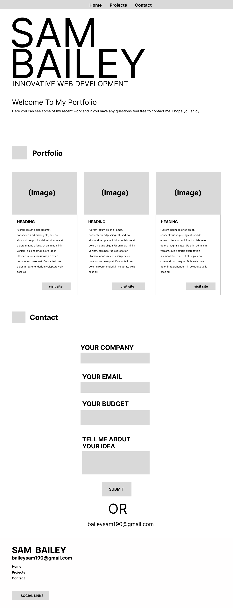
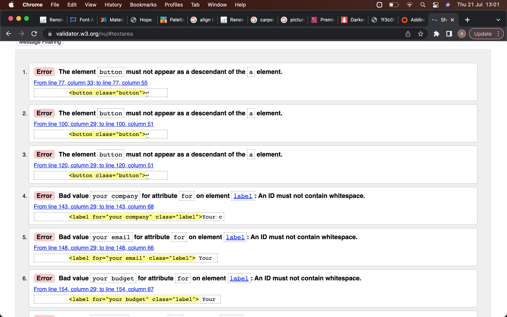
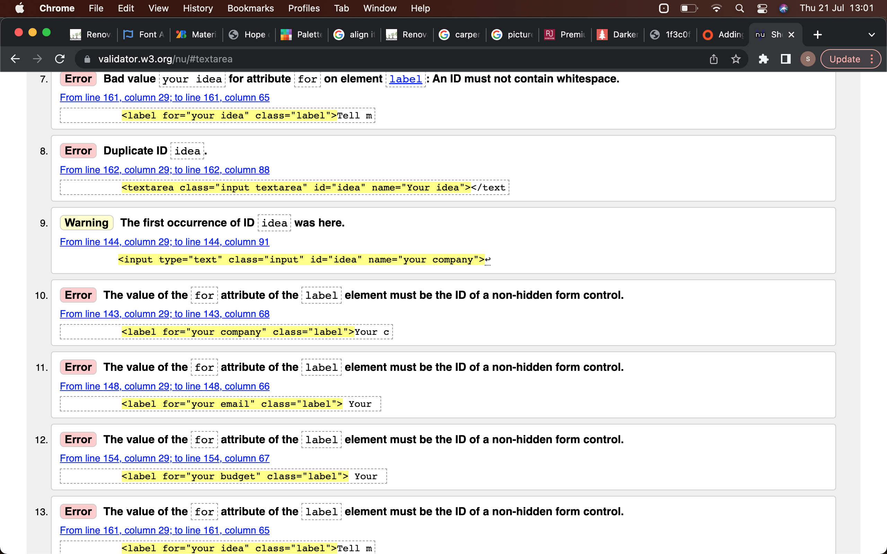
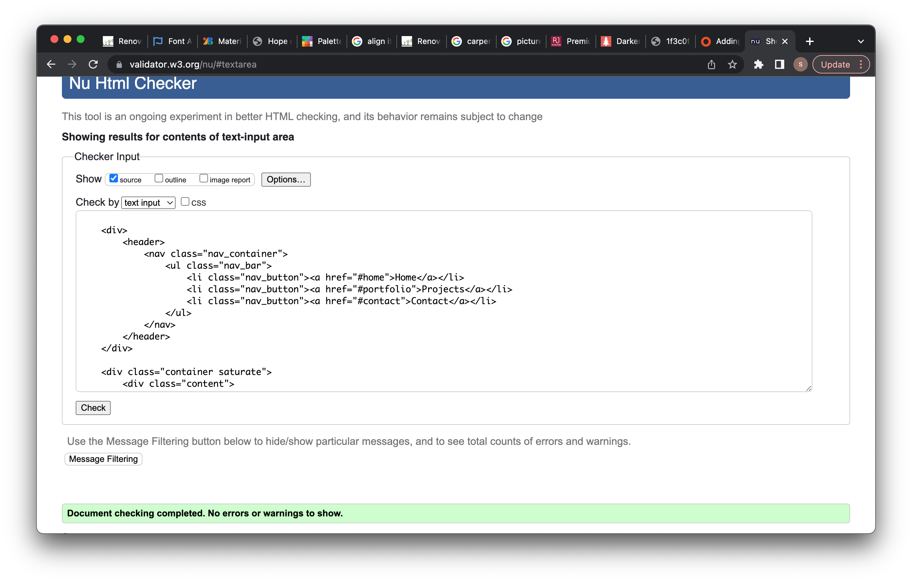

## Sam Bailey Portfolio ##

Single-Page HTML5/CSS3 portfolio website for my web projects.

## The Purpose Of The Website?. ##
The purpose of this portfolio website Is to showcase my work and skills to anybody who might want a website made for there company.

## User Stories ##

For first time users i would like them to be able to:


* Easily navigate around the site.
* Clearly see my work/projects.
* Easily contact me or enquire about work
* Wow them with the portfolio because that would be the first of my projects they would see.


For returning users:


* Be able to see any work i might have done for them displayed nice
* Again be able to navigate easily and contact me should they have anymore questions


  

## Wireframes ##


My wireframe was made using Figma.

## The Layout. ##
For this site I have chosen a fixed header so that navagation Is easy and possible where ever you are on the page.
Also the footer contains quick links around the site, as well as the links to social pages.
The siteIs splitInto three sections, my main header, the portfolio section and the contact section.

## Colors And Fonts ##
For my colors I have used red, black and white becauseI think they are very Impactful and all look good with eachother.
For my fontsI have used Bebas Nueue for all of my headings becauseItIs a nice bold font that stands out, and for my normal site contentI have used Roboto becauseItIs clean and easy to read.

##Interactive Elements ##
For my project cards In the portfolio section when theImages are hovered over there Is a small animation where theImage zooms In a little and returns to narmal when you move the cursor off the Image. The visit site button will open a new tab taking you to the website you have clicked.
I have made a contact form so I can collect data and potential leads on future work.

## File Structure ##
 `index.html` in website root
 assets folder
       * CSS for site styles
       * fonts for site fonts
       * images for site images
       * src for JavaScript

Assets in ```/assets``` directory (```js```, ``css``, ``images``)
I have added a README.md file to help myself for futre development also it is good practice and it will help any other developers who come across my work understand it better.
 
## CSS ##
In my CSS I have used BEM formatting soIt can easily be reused when needed also It makesIt much easier to follow. Here Is a link explaining a bit more about BEM formatting. http://getbem.com/introduction/ 
I have given my elements semantic class names to keep It simple and again make It easy to use.
I have stayed consistent with my colors, fonts, padding and margin.
for the margin and padding I have been usingIncrements of 8px so Its easy to follow.

## Animations ##
I have used a short animation where there is a cool saturate transition so the site starts off grey but all the color comes in after one second.
On the visit site buttons i have added a hover effect where the button changes color and some letter spacing is added to make it look cool.

## Iconography ##
For my icons I am using the FontAwsome icon library, I have used their icons to reinforce what each section is about on the page. I have also used their icons for links to my social pages in the footer.

## Typogrophy ##
For my main headers i have used a bold JosefinSans because i think it really stands out and looks really nice on the page. For any other text i have used a nice light Mulish, agai i think this is a nice easy font to read and looks good on the page. I have used the two different font weights so users can easily see the differnce between headers and normal text.

## Testing ##




To fix this i changed my ```<button>``` elements to ```<div>``` elements so i could keep them wrapped in my ```<a>```. I also gave my labels better names which sorted the last problem out now when I validate my code i see this.




## Deployment ##
For the deployment of my site i have used GIT pages. First i made my repository on GitHub. Then i linked my project from visual studio code to my repo using the git commands. Once this was done my repo was set up and once i had finished the project I pushed this to GitHub pages using the master branch waited a few seconds the page refreshed automatically and there was a live link to my published site.
